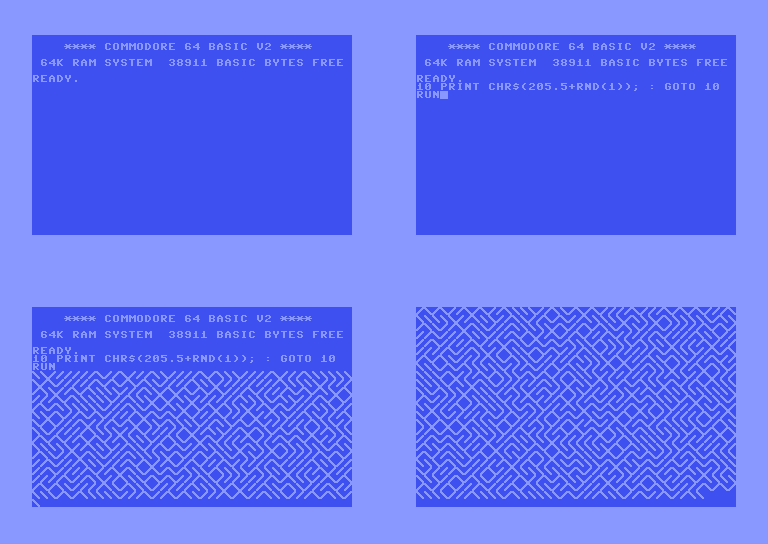
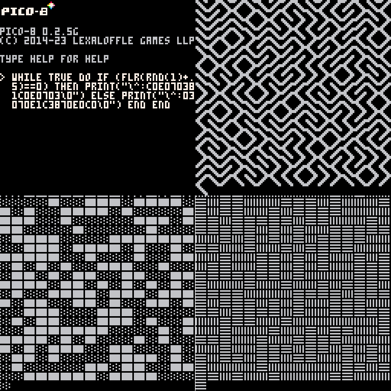
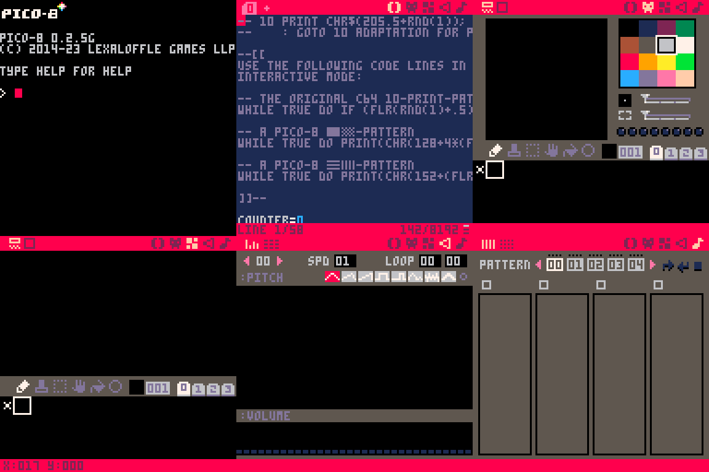
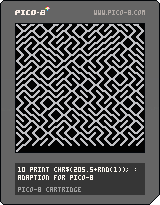

Developing games for the Steam Deck is so cool because you can do it on the same hardware as you will play your game. The same goes for the PICO-8. 

Back in the days, you were greeted by your home computer with a blinking cursor on a television or CRT monitor. Your computer was in an interactive mode where you could type in commands in the BASIC programming language. You could make your computer endlessly repeat your name or the sentence "HELLO, WORLD!" by typing the following three lines of code: 

`10 PRINT "HELLO, WORLD!"    20 GOTO 10    RUN` 

Of course, there were more sophisticating short programs like the well-known 10 PRINT one-liner:

`10 PRINT CHR$(205.5+RND(1)); : GOTO 10` 

This line of code makes a Commodore C64 home computer endlessly draw a maze-like pattern on the screen, and there is a full [book](#10print) about this simple Commodore 64 BASIC program, published in November 2012.  

A similar pattern can be created in PICO-8's interactive mode, still in one line, but with a bit more code, because the PICO-8 has a different set of characters, no line numbering, and a GOTO command that jumps to a corresponding label. The C64's special PETSCII characters for the maze must be encoded inline: 

`while true do if (flr(rnd(1)+.5)==0) then print("\^:c0e070381c0e0703\0") else print("\^:03070e1c3870e0c0\0") end end` 

There are other possibilities for nice maze-like patterns, more like the C64's one line of code, but with the PICO-8's P8SCII character set: 

`while true do print(chr(128+4*(flr(rnd(1)+.5))).."\0") end`

or

  
`while true do print(chr(152+(flr(rnd(1)+.5))).."\0") end` 

Apart from the interactive mode, PICO-8 comes with a built-in Code Editor, Sprite Editor, Map Editor, SFX Editor, and Music Editor:

A distributable version with all three of the above one-liners included and selectable inside without stopping the program can be made within minutes or hours and saved for [distribution](https://www.lexaloffle.com/bbs/?pid=134880) in PICO-8's super cool PNG-based P8.PNG virtual cartridge format.

The adaptation of 10 PRINT to the PICO-8 was fun. What will you come up with? 

Happy coding! 

References: 

[Nick Montfort et al., 10 PRINT CHR$(205.5+RND(1)); : GOTO 10](https://10print.org/)
