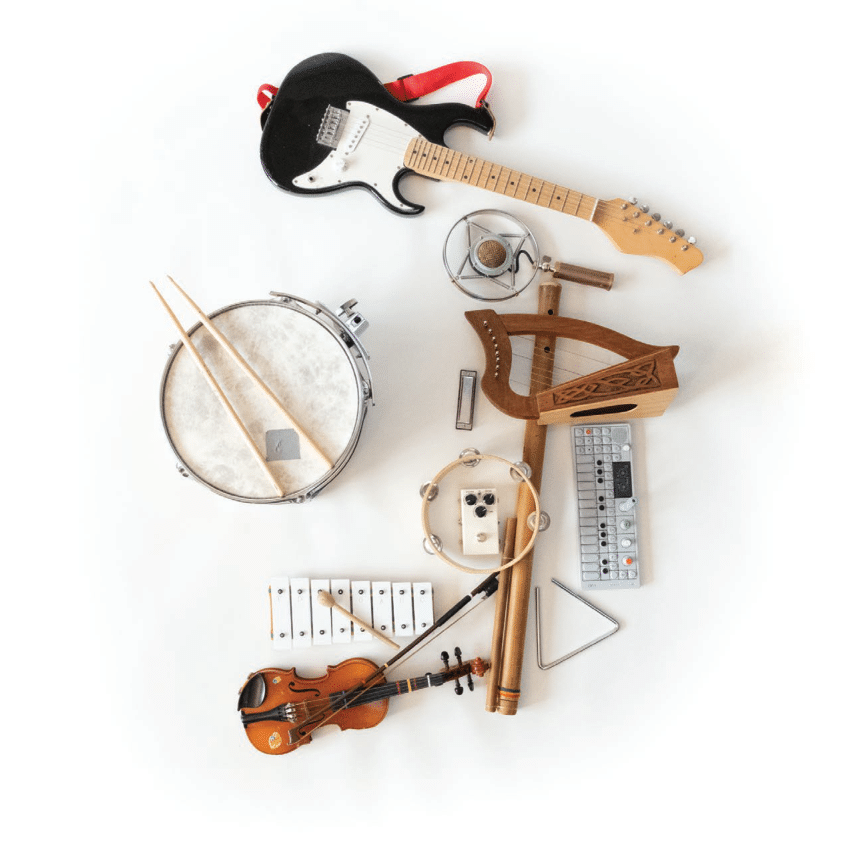
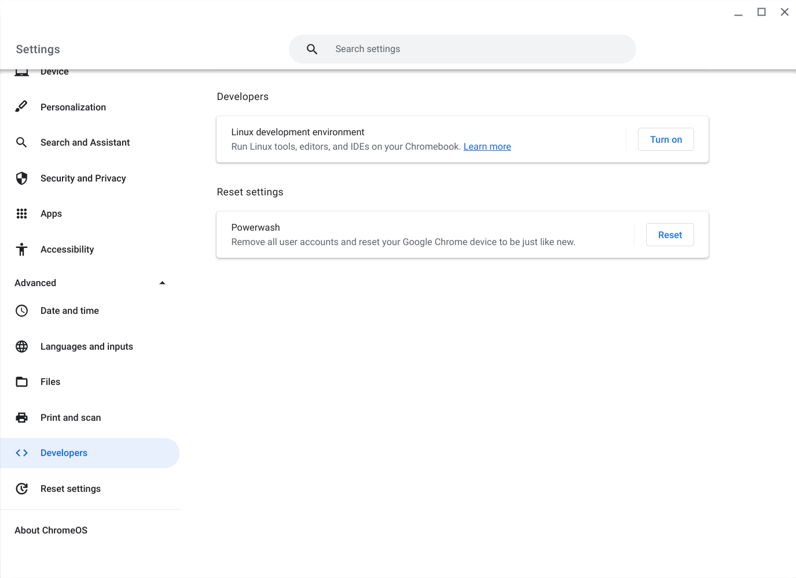
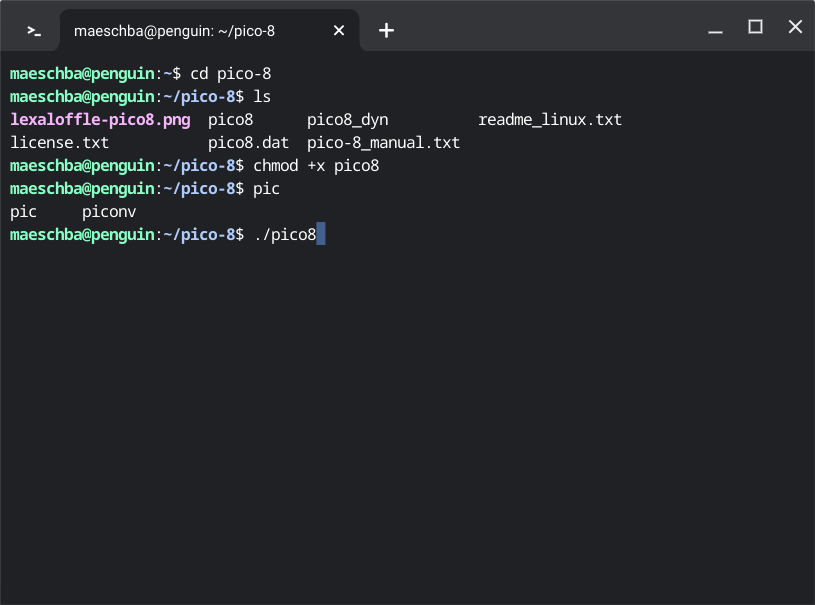
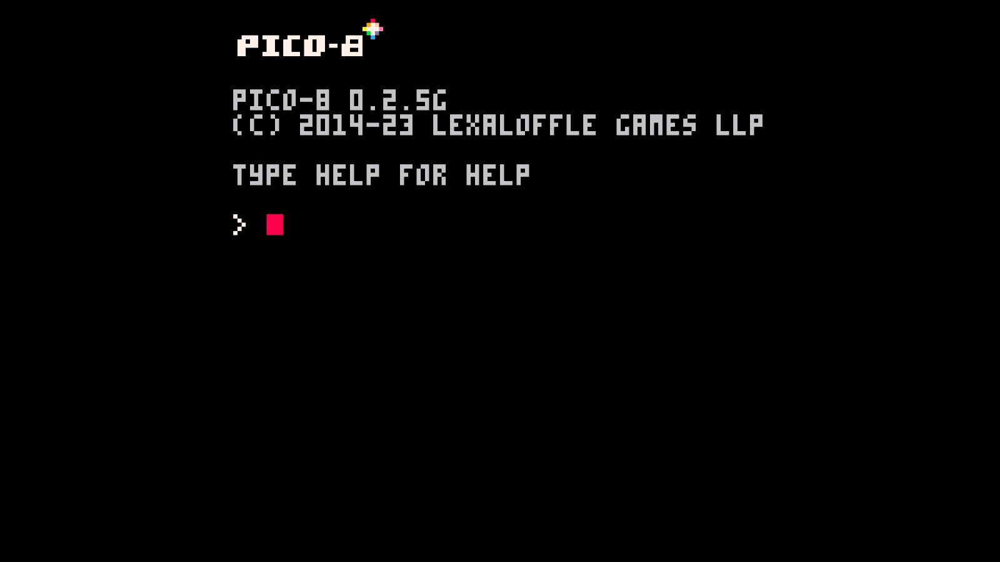

"[When you’re done playing games, what will you make with your Steam Deck?](#steamdeck)" Making games, of course. Making games on the same hardware than playing games was the big appeal of home computers in the 80'. The Steam Deck is a portable game console as well as a portable game development kit. The last page of Valve's Steam Deck Booklet shows several music instruments, one of them is the OP-1, teenage engineering's "[portable wonder synthesizer](https://teenage.engineering/products/op-1/original)". The Steam Deck will be the video game developer's OP-1. 

I did own several home computers when I was a kid, back in the 80', and I always wanted to make games on them, but BASIC was not a language to make a cool game, and assembly language was out of my reach. When I finally got a copy of Borland's Turbo Pascal compiler, music and girls had become much more interesting than computers. The home computer's place had been taken by an electric guitar. 

A decade later, I quit working as a software engineer and started making video games in Macromedia Director, doodled with a Game Boy Advance development kit (I was incredibly lucky to get one from Nintendo of America), and tried to sell Java games for mobile phones. Another decade and an academic degree later, I created a mobile game for Android and iOS. 

Third time is a charm. The Steam Deck will be my portable wonder console. 

While setting up my Steam Deck for game development, and having it running in desktop mode, with a Steam Deck Dock, keyboard, mouse, and monitor, I realized, that this set-up means serious business. It is powerful and portable, without taking the external monitor into account, but for a fun little project on the go or while drinking coffee in the morning, there needs to be a much less ambitious solution. I normally turn my computer on later in the morning. My early mornings belong to my mobile phone, my e-book reader, or my Chromebook. A Sunday morning game creating solution would be a PICO-8 installation on a Chromebook! 

The hardware I am using is an ASUS Chromebook Flip C436 running the stock Google ChromeOS, but any Chromebook that is capable running a Linux development environment should do. All you must do is to turn the "Linux development environment" on in "Settings" and unpack the pico-8 folder from Lexaloffle's official Linux download to your Chromebook's Linux files. 

After changing the permission of the pico8 binary to executable, you can run PICO-8 and make, share, and play "[tiny games and other computer programs](https://www.lexaloffle.com/pico-8.php)". 

Happy programming! 

References: 

[Steam Deck Booklet](https://cdn.cloudflare.steamstatic.com/steamdeck/images/press/book/steamDeck_booklet_EN.pdf)
