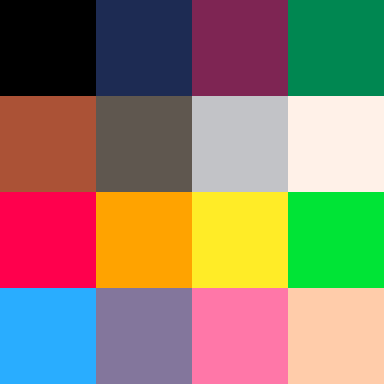
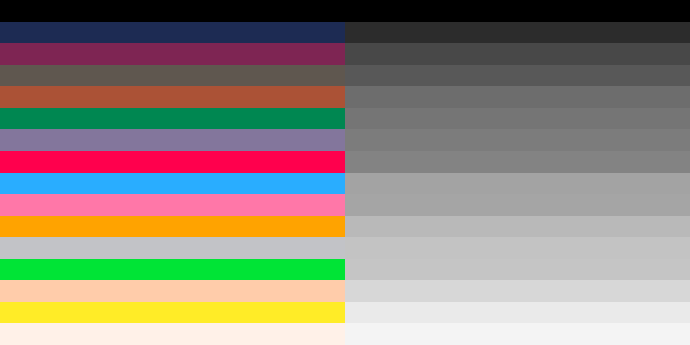
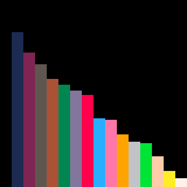

The PICO-8 has a [fixed 16 color palette](#lexaloffle) consisting of the colors black, dark blue, dark purple, dark green, brown, dark grey, light grey, white, red, orange, yellow, green, blue, indigo, pink, and peach. The following image shows these 16 colors ordered top-left to bottom right as they appear on the screen in PICO-8: 

To better combine these colors when creating sprites and background tiles, I converted the above screenshot with GIMP to an [8-bit integer grayscale image](https://docs.gimp.org/2.10/en/gimp-image-convert-grayscale.html). Having the tonal steps of these colors will help choosing good color combinations to separate the foreground of an image or a video game from its background.  

I printed these images to paper and cut them out to sort the 16 colors by eye first. The resulting order was consistent with the ranking of the values provided digitally with the help of GIMP's color picker tool and info window.  

The PICO-8's 16 colors, ordered by their grayscale tonal value, are black, dark blue, dark purple, dark grey, brown, dark green, indigo, red, blue, pink, orange, light grey, green, peach, yellow, and white.

Some of these colors have very similar tonal values, others have more contrast between them. The following screenshot shows all 16 colors ordered by tonal value left to right. The height of the column represents the darkness of the corresponding color (0=dark, 255=white). Note that the white of the PICO-8 16 color palette is not fully white, but only 96%. Its grayscale tonal value is 244, while its RGB value in hexadecimal notation is fff1e8.

Happy coding!

References:

[PICO-8 User Manual](https://www.lexaloffle.com/dl/docs/pico-8_manual.html)
