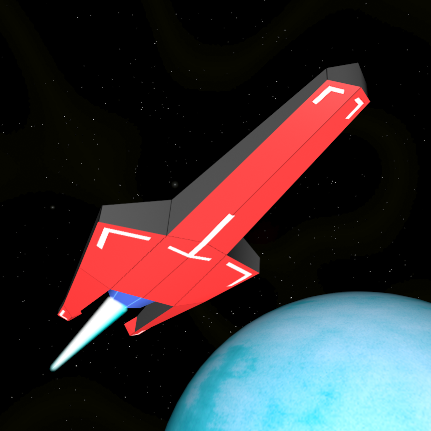
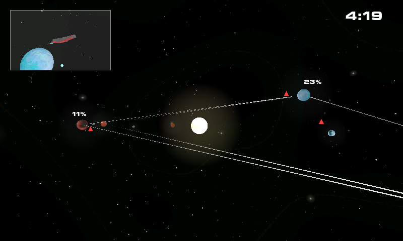
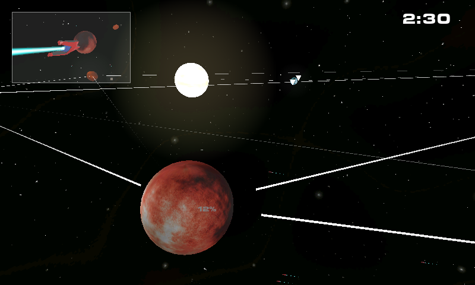
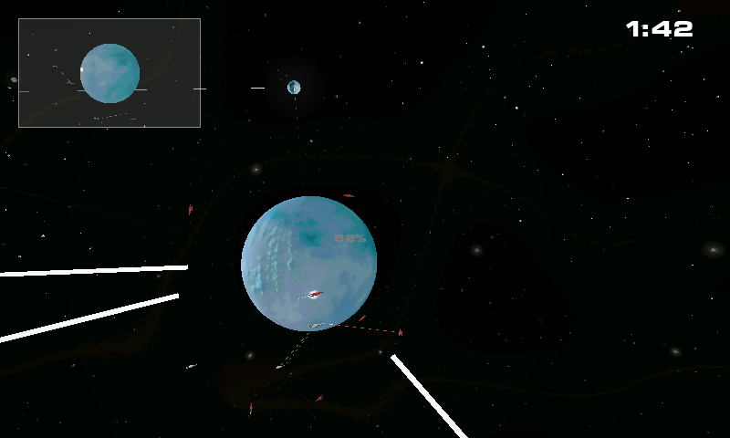
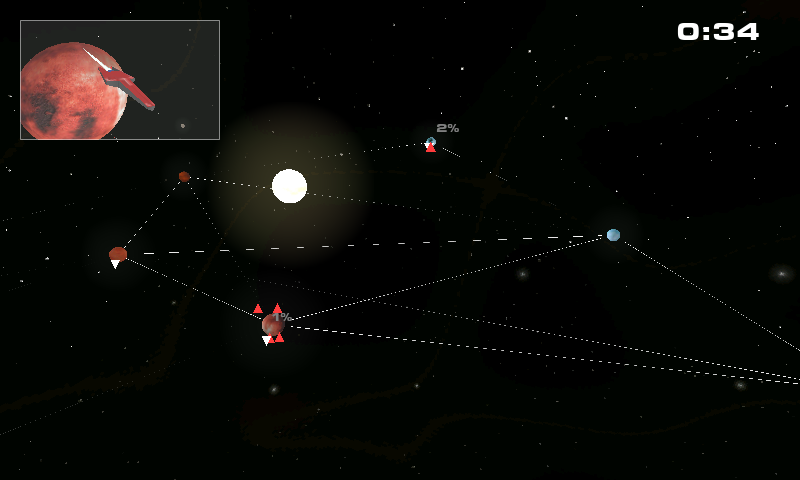
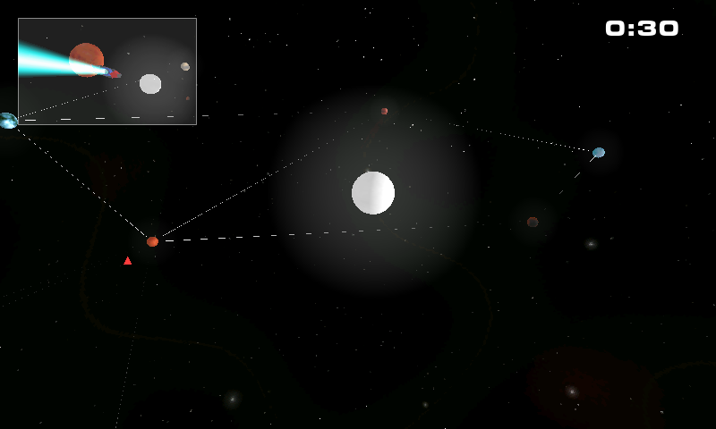
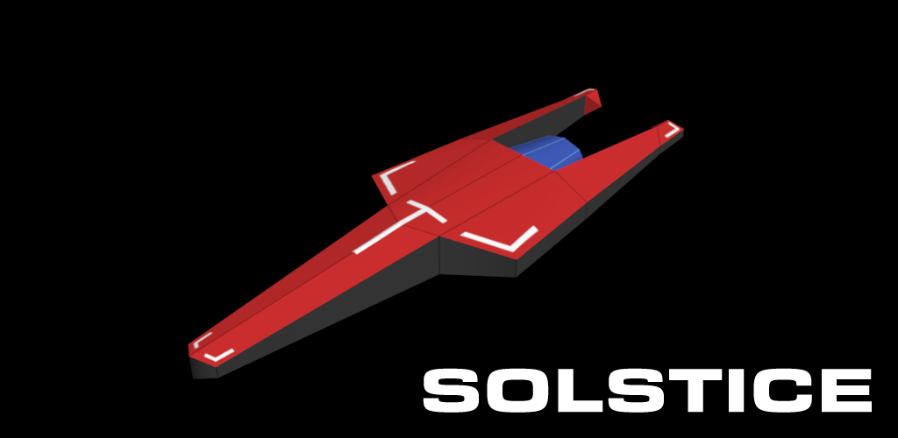
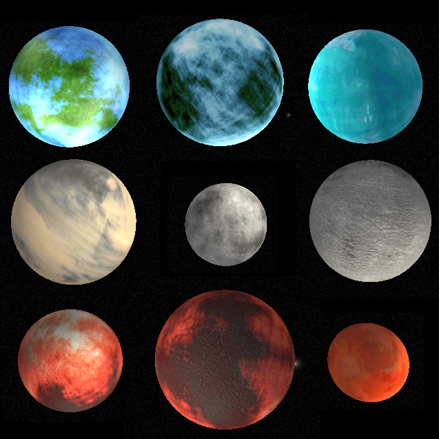
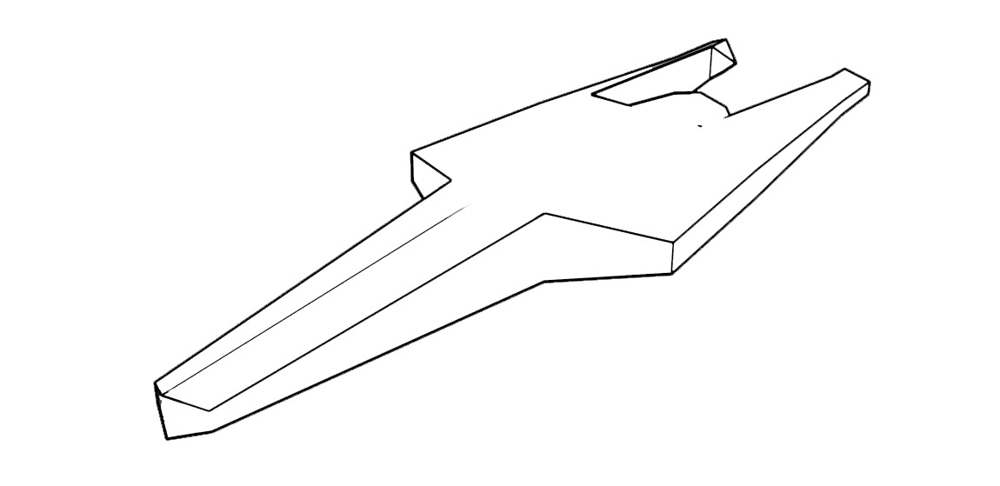
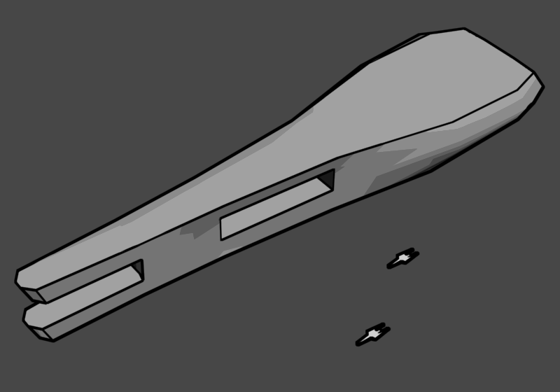

Back in 2011 and 2012, I developed Solstice, a "[3D Space Fleet Combat Real Time Strategy Game](https://web.archive.org/web/20130413043319/http://deepseaweed.net/solstice.html)" for the then rather new Android based smartphones. In the beginning, the goal was to take the real time combat sequences of big [4X](https://en.wikipedia.org/wiki/4X) games like [Sword of the Stars](https://en.wikipedia.org/wiki/Sword_of_the_Stars), running on computers, and create a mobile game out of that experience.

Unfortunately, the whole appeal of these combat sequences lies in having great graphics and effects. Even though I used a professional game engine (Unity3D, as it was named at the time) and software (3D Studio Max and Adobe Photoshop), I couldn't create the game like I had it envisioned, and very soon I changed the scope of Solstice from being a mobile part of the 4X genre to being a mini space strategy game in itself.

I created an initial Android version in three month and kept updating the game for over a year. During this time, I profited from Unity to port my game also to desktop devices running Window or Linux as well as Apple devices running MacOS or iOS.

It has been a good time, even though sales on Android were poor. All aspects of the initial version of the game have been done by myself. Later versions contained a fitting soundtrack composed by [Artem Bank](https://artembank.bandcamp.com/album/solstice).

Unfortunately, the source code and all the assets of Solstice have been lost — destroyed — I deleted them from my harddisk as I did with nearly all of my old files. My old Google Developer account still exists and I consider using it again in the future.

The images below are still available in the IndieDB and I apparently created a YouTube account as DeepseaweedGames.

https://youtu.be/JzbV-758Peo?si=FCfEPDHZ8fW3ERMx

After I cancelled the deepseaweed.net domain, I copied my website to Google. Googles Classic Sites have been migrated some years ago, without keeping my data, but the original webpage contents without images for [Deepseaweed](https://web.archive.org/web/20121231185705/http://deepseaweed.net/index.html) and [Solstice](https://web.archive.org/web/20130413043319/http://deepseaweed.net/solstice.html) are still available in the Wayback Machine of the [Internet Archive](https://archive.org/).

Happy memories!
